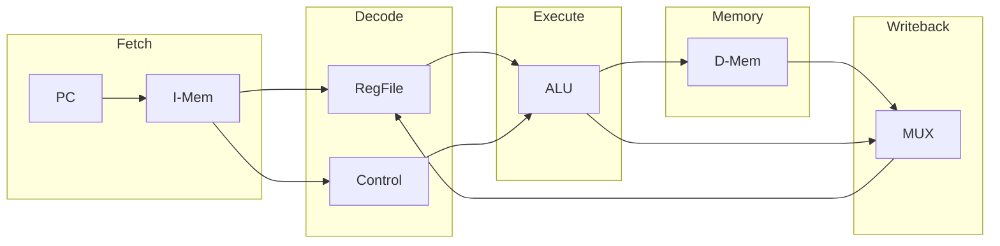

# RISC-V Pipelined Processor (RV32I)

[](https://github.com/cshieldsce/riscv-5/actions/workflows/ci.yml)
[](https://github.com/cshieldsce/riscv-5/actions/workflows/compliance.yml)
[](https://opensource.org/licenses/MIT)

This repository contains a synthesizable 5-stage pipelined RISC-V core (RV32I) implemented in SystemVerilog. The project emphasizes hardware-software co-design, formal verification via the RISCOF framework, and physical implementation on FPGA.

---

## Design Vision

The goal of this project is to implement a cycle-accurate RISC-V implementation that strictly adheres to the unprivileged ISA specification. By following the architectural patterns established in Patterson & Hennessy, the design provides a clear mapping between microarchitectural theory and RTL implementation.

## Technical Features

- **5-Stage Pipeline:** Decoupled Instruction Fetch (IF), Decode (ID), Execute (EX), Memory (MEM), and Writeback (WB) stages.
- **Hazard Handling:** Integrated forwarding unit and load-use stall logic to mitigate data hazards.
- **ISA Compliance:** Verified against the RISC-V Architectural Test Suite (RISCOF) with a 100% pass rate.
- **Synthesizable RTL:** Optimized for Xilinx Zynq-7000 series FPGAs, specifically tested on the PYNQ-Z2.
- **Automated Verification:** Continuous integration using Spike as a golden reference model.

---

## Architecture Overview

The core follows the classic RISC-V pipeline structure.



### Documentation
Detailed technical documentation is available in the `docs/` directory:
- **[Architecture Manual](./docs/index.md):** Theoretical mapping and stage-by-stage analysis.
- **[Verification Report](./docs/verification/compliance.md):** Compliance Matrix and debugging retrospectives.
- **[Developer Guide](./docs/developer/setup.md):** Environment configuration and simulation workflow.

---

## Getting Started

### Functional Verification
Execute the regression suite to verify core integration:
```bash
./test/scripts/regression_check.sh
```

### ISA Compliance
Run the full RISCOF suite (requires riscof, spike, and riscv64-unknown-elf-gcc):
```bash
./test/verification/run_compliance.sh
```

---

## Project Structure

```text
├── src/           # SystemVerilog RTL
├── test/          # RISCOF configuration and testbenches
├── fpga/          # Vivado TCL scripts and XDC constraints
└── docs/          # Technical documentation and diagrams
```

## References

- *Computer Organization and Design (RISC-V Edition)* - Patterson & Hennessy.
- *RISC-V Instruction Set Manual Volume I: Unprivileged ISA*.