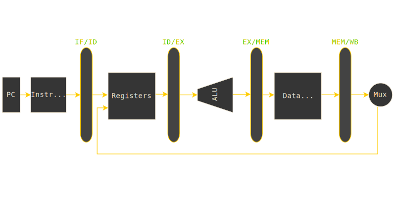

<link rel="stylesheet" href="{{ '/assets/css/style.css' | relative_url }}">

  <a href="../index.html">Home</a>
  <a href="./manual.html">Architecture Overview</a>
  <a href="./stages.html">Pipeline Stages</a>
  <a href="./hazards.html">Hazard Resolution</a>
  <a href="../verification/report.html">Verification</a>
  <a href="../developer/guide.html">Developer Guide</a>

# Architecture Manual: The Theoretical Anchor

This document proves to anchor every design decision in the `riscv-5` core to the official RISC-V ISA Specification and the seminal microarchitecture text *Patterson & Hennessy (RISC-V Edition)*.

---

## Introduction

### The Single-Cycle Problem

To understand why we build pipelined processors, we first have to look at the limitations of a **Single Cycle CPU**. In a single-cycle implementation, the entire execution of an instruction—fetching from memory, decoding, calculating in the ALU, accessing data memory, and finally writing back to registers must happen in exactly one clock tick.

You can think of a Single Cycle CPU as one giant combinational circuit, and the critical path as "one long wire" spanning from the Fetch to Writeback. If the signal has to travel through 50 gates to get from the Instruction Memory to the Register Writeback, your clock cycle must be long enough for the electricity to traverse all 50 gates at once. While this design is simple to understand, it is practically inefficient.

FPGA Tip
If you have used Xilinx Vivado to synthesize a core, you likely encountered <strong>Total Negative Slack (TNS)</strong>. In a Single Cycle CPU, the "Critical Path" (the longest path between two registers) is effectively the entire length of the CPU. Vivado will report timing violations because the signal physically cannot travel to the logic gates fast enough.

### The Solution: Pipelining

The diagram below shows the clean separation of stages that pipelining enables:

*Figure 1: The 5-stage RISC-V pipeline. Each stage operates independently on different instructions.*

Pipelining solves this by breaking that "one long wire" into smaller, independent segments separated by Pipeline Registers. Instead of one cycle needing to cover the Fetch to Writeback distance, the clock cycle only needs to be long enough for the longest individual stage (e.g., just the Execute stage).

This architecture shift dramatically increases **Throughput**. While the time to execute one individual instruction (Latency) stays roughly the same, the rate at which we finish instructions skyrockets.

| Metric | Single Cycle CPU | Pipelined CPU |
|--------|------------------|---------------|
| **Clock Speed** | Low (~10 MHz) | High (**50-100 MHz+**) |
| **Instructions Per Cycle** | 1 | 1 (Ideal) |
| **Logic Depth** | 50+ Gates (Deep) | ~10 Gates (Shallow) |
| **Vivado Timing** | Negative Slack (-) | Positive Slack (+) |

Latency vs Throughput
It is a common misconception that pipelining reduces the execution time of a single instruction; in fact, individual latency often increases slightly due to register overhead. The true performance gain comes from throughput, as the processor completes one instruction every clock cycle rather than waiting for the entire datapath to finish. We accept this minor latency cost to achieve a massive increase in overall system frequency and processing rate.

---

## Building the Core

### Motivations

Motivations: SystemVerilog and functional programming

Found the Hennessy book, everybody said it was the best, started reading in conjunction with the ISA spec, went from there.

---

## 1. Mapping the Textbook to the RTL

The 5-stage pipeline is a faithful instantiation of the classic microarchitecture defined in **Section 4.6** of *Patterson & Hennessy*.

**Figure 1** illustrates the theoretical 5-stage RISC-V datapath as described in *Patterson & Hennessy*. Ideally, one instruction completes every cycle.

### 1.1 The Pipelined Datapath (Section 4.6)

Pipeline stage registers are the backbone of the pipeline, they allow us to transfer data freely between stages with blocking the flow of instructions. In the RTL, these registers carry data and control signals forward, ensuring that signals are synchronized with the instruction they control. This allows us to effectively synchronized the data and control signals required for instruction.

---

## References

1. **Patterson, D. A., & Hennessy, J. L.** (2017). *Computer Organization and Design: The Hardware/Software Interface (RISC-V Edition).* Morgan Kaufmann.
   - Chapter 4: The Processor — 5-stage pipeline architecture
   - Section 4.6: Pipelined datapath and control

2. **RISC-V Foundation.** *The RISC-V Instruction Set Manual Volume I: Unprivileged ISA (v20191213).*
   - Section 2: RV32I Base Integer ISA
   - Section 2.6: Load and Store Instructions
   - Section 12: Instruction Formats and Encoding

3. **RISC-V Software Tools Documentation.** *riscv64-unknown-elf-gcc* and *spike* simulator.

---

**Last Updated:** January 2026  
**Author:** Charles Shields