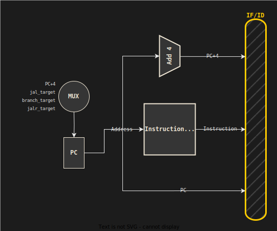
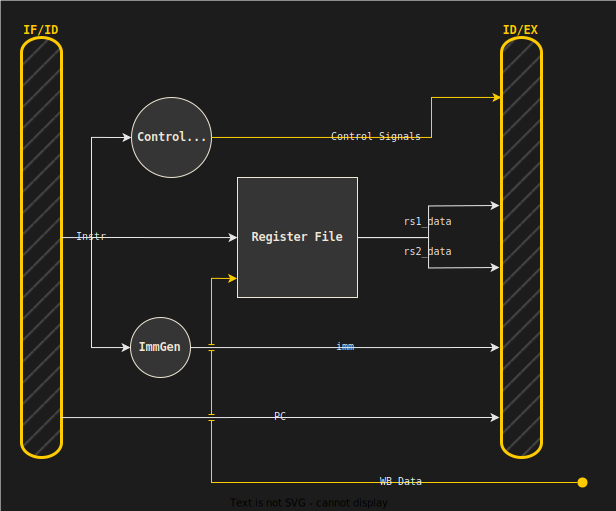
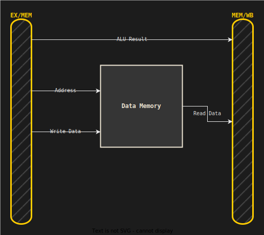
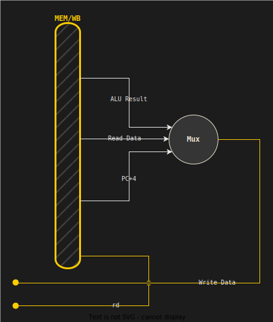

<link rel="stylesheet" href="{{ '/assets/css/style.css' | relative_url }}">
<div class="site-nav">
  <a href="../index.html">Home</a>
  <a href="./manual.html">Architecture Overview</a>
  <a href="./stages.html">Pipeline Stages</a>
  <a href="./hazards.html">Hazard Resolution</a>
  <a href="../verification/report.html">Design Verification</a>
  <a href="../verification/fpga.html">FPGA Implementation</a>
  <a href="../developer/guide.html">Setup Guide</a>
</div>

# 2. Pipeline Stages & Microarchitectural Logic

This section maps the theoretical pipeline stages from *Patterson & Hennessy* to our SystemVerilog implementation, proving that each stage faithfully implements the RISC-V ISA specification.

## Complete Datapath
Before diving into individual stages, here's the full pipeline with all major signals labeled:


*Figure 3: Complete datapath showing pipeline registers, forwarding paths, and hazard detection units. Based on Patterson & Hennessy Figure 4.51.*

This diagram maps directly to our SystemVerilog implementation in [`src/pipelined_cpu.sv`](../../src/pipelined_cpu.sv).


## 2.1 Instruction Fetch (IF)


*Figure 4: IF stage showing PC selection multiplexer and instruction memory interface.*

**Implementation:** `if_stage.sv`  
**Objective:** Fetch the next instruction from memory and calculate `PC+4`.

The IF stage is responsible for maintaining program flow. It receives a `next_pc` value (either sequential or redirected due to branches/jumps) and outputs the current PC, the fetched instruction, and the default next address (`PC+4`).

### RTL Implementation

```verilog
// --- Next PC Logic ---
logic [XLEN-1:0] if_pc_reg;
logic [XLEN-1:0] if_next_pc;
logic [XLEN-1:0] if_pc_plus_4_calc;

assign if_pc_plus_4_calc = if_pc_reg + 4;

// -- Select Next PC based on control signals ---
always_comb begin: SelectNextPC
    if (stall) begin : Stalled
        if_next_pc = if_pc_reg;        
    end else if (jalr_taken) begin : JALRTaken
        if_next_pc = jalr_target;          
    end else if (branch_taken) begin : BranchTaken
        if_next_pc = branch_target;       
    end else if (jal_taken) begin : JALTaken
        if_next_pc = jal_target;         
    end else begin : IncrementPC
        if_next_pc = if_pc_plus_4_calc;
    end 
end

// -- Update or Hold PC ---
always_ff @(posedge clk) begin : PC_Register
    if (rst) begin : ResetPC
        if_pc_reg <= {XLEN{1'b0}};
    end else begin : UpdatePC
        if_pc_reg <= if_next_pc;
    end
end

// --- Outputs ---
assign pc_out          = if_pc_reg;
assign pc_plus_4       = if_pc_plus_4_calc;
assign instruction_out = instruction_in;
```

### PC Selection Logic

The PC selection multiplexer determines the next instruction address based on control hazards. This logic prioritizes control flow changes in order of detection (stalls take highest priority, followed by resolved jumps/branches):

1.  **Stall:** Keep current PC.
2.  **JALR:** Indirect jump resolved in EX stage.
3.  **Branch:** Conditional branch resolved in EX stage.
4.  **JAL:** Direct jump resolved in ID stage (optimization).
5.  **Sequential:** `PC + 4`.

### Design Rationale

By detecting `JAL` early in the ID stage (since the target is just `PC + Immediate`), we reduce the control hazard penalty from 2 cycles to 1 cycle. However, `JALR` and conditional branches still incur a 2-cycle penalty because they require ALU computation. (described in <a href="./hazards.html#case-5-control-hazards-branch-misprediction-">Hazard Resolution, Case 5</a>).

<div class="callout note"><span class="title">Design Decision</span>
JAL is a direct jump, so the target address is known immediately from the instruction encoding. JALR is indirect—the target depends on register content—so it can't be resolved until the EX stage. This asymmetry is why we get different penalty costs.
</div>

---

## 2.2 Instruction Decode (ID)


*Figure 5: ID stage with control unit, register file, and immediate generator.*

**Implementation:** `id_stage.sv`  
**Objective:** Decode the instruction, generate control signals, read registers, and produce the immediate value.

The ID stage is the "brain" of the pipeline, translating binary opcodes into control signals and preparing operands for execution.

### Instruction Field Extraction

```verilog
assign opcode = opcode_t(instruction[6:0]);
assign rd     = instruction[11:7];
assign funct3 = instruction[14:12];
assign rs1    = instruction[19:15];
assign rs2    = instruction[24:20];
assign funct7 = instruction[31:25];
```

### ISA Compliance

This stage implements the decoding logic for all RV32I base instructions (Sections 2.2-2.5 of the RISC-V Unprivileged ISA Specification). The `ImmGen` module correctly handles the sign-extension requirements for I-type, S-type, B-type, U-type, and J-type immediate formats.

<div class="callout note"><span class="title">ISA Reference</span>
See <em>RISC-V Unprivileged ISA Specification v20191213</em>, Section 2: "RV32I Base Integer ISA". All instruction formats and encoding are defined there.
</div>

---

## 2.3 Execute (EX)


*Figure 6: EX stage showing forwarding multiplexers and branch resolution logic.*

**Implementation:** `ex_stage.sv`  

The `EX` stage is where the actual computation happens. It receives operands (potentially forwarded from later stages), performs the requested operation, and determines if branches should be taken.

### 1. Forwarding Multiplexers

The forwarding unit provides two 2-bit control signals (`forward_a`, `forward_b`) that select the most recent data:

```verilog
always_comb begin : ForwardA_MUX
    case (forward_a)
        2'b00:   ex_alu_in_a_fwd = rs1_data;            // No hazard (Register)
        2'b01:   ex_alu_in_a_fwd = wb_write_data;       // Forward from WB
        2'b10:   ex_alu_in_a_fwd = ex_mem_alu_result;   // Forward from MEM
        default: ex_alu_in_a_fwd = rs1_data;
    endcase
end
```

### 2. ALU Source Multiplexers

The `op_a_sel` signal handles special cases like `LUI` (Load Upper Immediate) and `AUIPC` (Add Upper Immediate to PC):

```verilog
always_comb begin : ALUInputA_MUX
    case (op_a_sel)
        2'b00:   ex_alu_in_a = ex_alu_in_a_fwd;          // Regular register op
        2'b01:   ex_alu_in_a = pc;                       // AUIPC: PC
        2'b10:   ex_alu_in_a = {XLEN{1'b0}};             // LUI: Zero
        default: ex_alu_in_a = ex_alu_in_a_fwd;
    endcase
end

assign ex_alu_in_b = op_b_sel ? imm : rs2_data_forwarded;
```

<div class="callout tip"><span class="title">LUI Trick</span>
LUI (Load Upper Immediate) loads a 20-bit immediate into bits [31:12]. The RISC-V ISA defines this as: <code>rd = imm << 12</code>. By setting <code>A = 0</code> and <code>B = (imm << 12)</code>, we can reuse the ALU's addition operation: <code>0 + (imm << 12) = imm << 12</code>. This is an elegant hardware reuse pattern.
</div>

### 3. Branch Resolution Logic

```verilog
always_comb begin
    if (branch_en) begin
        case (funct3)
            F3_BEQ:  branch_taken = alu_zero;          // A == B
            F3_BNE:  branch_taken = ~alu_zero;         // A != B
            F3_BLT:  branch_taken = alu_result[0];     // A < B (signed)
            F3_BGE:  branch_taken = ~alu_result[0];    // A >= B (signed)
            F3_BLTU: branch_taken = alu_result[0];     // A < B (unsigned)
            F3_BGEU: branch_taken = ~alu_result[0];    // A >= B (unsigned)
            default: branch_taken = 1'b0;
        endcase
    end else begin
        branch_taken = 1'b0;
    end
end

assign branch_target = pc + imm;
```

<div class="callout note"><span class="title">Implementation Detail</span>
The ALU computes both signed and unsigned comparison results. <code>BLT</code>/<code>BGE</code> use the signed result (bit 0 of SLT operation), while <code>BLTU</code>/<code>BGEU</code> use the unsigned equivalent. The branch resolution logic simply selects the appropriate comparison output.
</div>

---

## 2.4 Memory Access (MEM)


*Figure 7: MEM stage showing Data Memory interface and byte enable logic.*

**Implementation:** `mem_stage.sv`  

The `MEM` stage translates RISC-V load/store operations into physical memory accesses. It includes logic for store data forwarding (handling the "EX-to-MEM" hazard for stores) and byte enable generation.

### Byte Enable Generation

RISC-V supports sub-word memory accesses (`LB`, `LH`, `SB`, `SH`). The `mem_stage.sv` module calculates the byte enable signal (`dmem_be`) using a helper function:

```verilog
function automatic logic [3:0] get_byte_enable(logic [2:0] funct3, logic [1:0] addr_lsb);
    case (funct3)
        F3_BYTE: begin : ByteEnable
            case (addr_lsb)
                2'b00: return 4'b0001;
                2'b01: return 4'b0010;
                2'b10: return 4'b0100;
                2'b11: return 4'b1000;
            endcase
        end
        F3_HALF: begin : HalfwordEnable
            case (addr_lsb[1])
                1'b0: return 4'b0011;   // Lower halfword
                1'b1: return 4'b1100;   // Upper halfword
            endcase
        end
        default: return 4'b1111;        // Word access
    endcase
endfunction

assign dmem_be = get_byte_enable(ex_mem_funct3, ex_mem_alu_result[1:0]);
```

---

## 2.5 Writeback (WB)


*Figure 8: WB stage showing the final result selection multiplexer.*

**Implementation:** `wb_stage.sv`  

The `WB` stage resolves the final value for the destination register using the `wb_mux_sel` control signal:

```verilog
always_comb begin : WriteBackMUX
    case (mem_wb_wb_mux_sel)
        2'b00: wb_write_data = mem_wb_alu_result;     // ALU instructions
        2'b01: wb_write_data = dmem_read_data;        // Load instructions
        2'b10: wb_write_data = mem_wb_pc_plus_4;      // JAL/JALR (Return address)
        default: wb_write_data = {XLEN{1'b0}};        // Safety default
    endcase
end
```

### ISA Compliance

- `mem_to_reg = 00`: Standard ALU operations (ADD, SUB, AND, etc.)
- `mem_to_reg = 01`: Load instructions that read from memory
- `mem_to_reg = 10`: Jump-and-link instructions that save the return address (PC+4) into rd

<div class="callout tip"><span class="title">Why PC+4 for JAL/JALR?</span>
See <em>RISC-V Unprivileged ISA Specification</em>, Section 2.5: "Control Transfer Instructions". JAL and JALR store the address of the next instruction into the destination register to enable function returns. The callee can execute <code>JALR x0, 0(ra)</code> to jump back using the saved return address.
</div>

## 2.6 Pipeline Register Summary

Each pipeline register preserves the architectural state needed by downstream stages. Below is a summary of the data and control signals carried by each register:

| Register | Data Fields | Control Signals | Purpose |
|----------|-------------|-----------------|---------|
| **IF/ID** | `pc`, `instruction`, `pc+4` | None (control generated in ID) | Preserve fetched instruction for decoding |
| **ID/EX** | `pc`, `pc+4`, `rs1_data`, `rs2_data`, `imm`, `rs1`, `rs2`, `rd`, `funct3` | `reg_write`, `mem_write`, `alu_control`, `alu_src`, `alu_src_a`, `mem_to_reg`, `branch`, `jump`, `jalr` | Supply operands and control for execution |
| **EX/MEM** | `alu_result`, `rs2_data`, `rd`, `pc+4`, `funct3`, `rs2` | `reg_write`, `mem_write`, `mem_to_reg` | Interface with memory and preserve results |
| **MEM/WB** | `mem_read_data`, `alu_result`, `rd`, `pc+4` | `reg_write`, `mem_to_reg` | Select data for register writeback |

<div class="callout note"><span class="title">Design Note</span>
We include <code>rs2</code> in the <code>EX/MEM</code> register to enable store data forwarding (described in <a href="./hazards.html#case-4-the-load-use-hazard-the-physical-limit">Hazard Resolution, Case 4</a>). Without it, store instructions couldn't forward dependent values to memory writes. This is a subtle optimization not always shown in textbook diagrams but critical for correctness.
</div>

---
*riscv-5: a 5-Stage Pipelined RISC-V Processor (RV32I) by [Charlie Shields](https://github.com/cshieldsce), 2026*