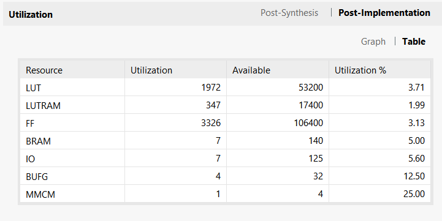
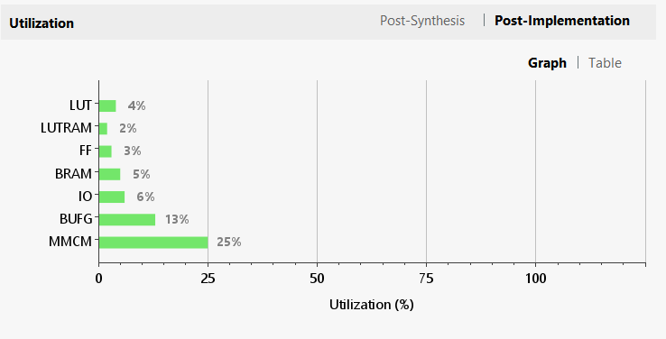
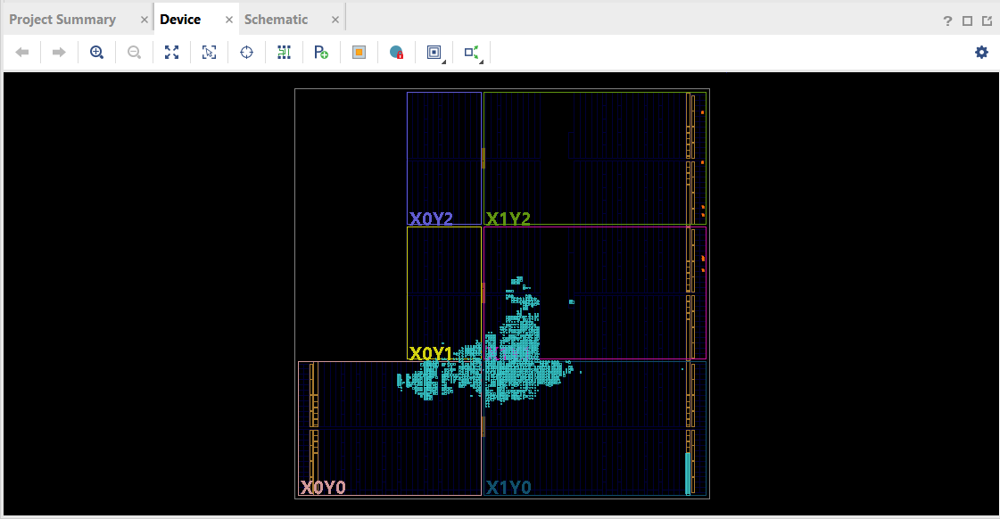
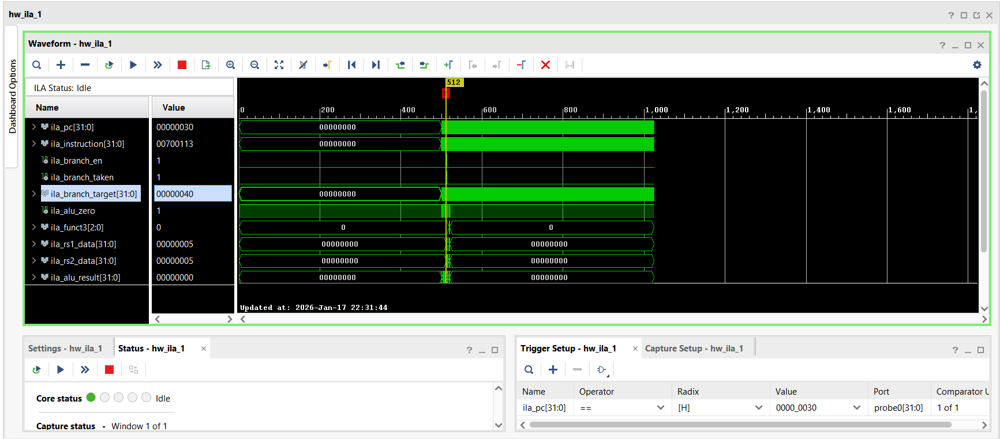

<link rel="stylesheet" href="{{ '/assets/css/style.css' | relative_url }}">
<div class="site-nav">
  <a href="../index.html">Home</a>
  <a href="../architecture/manual.html">Architecture Overview</a>
  <a href="../architecture/stages.html">Pipeline Stages</a>
  <a href="../architecture/hazards.html">Hazard Resolution</a>
  <a href="./report.html">Design Verification</a>
  <a href="./fpga.html" class="active">FPGA Implementation</a>
  <a href="../developer/guide.html">Setup Guide</a>
</div>

# FPGA Implementation & Hardware Validation

This page documents the process and results of deploying the `riscv-5` core on real FPGA hardware. Here, we showcase synthesis results, resource utilization, timing closure, and a live demonstration of the core running the Fibonacci test.

---

## 1. Synthesis Overview

- **Target Board:** Xilinx PYNQ-Z2 (Zynq-7000)
- **Toolchain:** Vivado 2025.2
- **Top Module:** `pynq_z2_top.sv`

### Synthesis Summary

<div class="img-wrapper screenshot">
  
  <span class="caption">Table: Resource utilization on Zynq-7000.</span>
</div>

<div class="img-wrapper screenshot">
  
  <span class="caption">Graph: Utilization by hierarchy.</span>
</div>

The core was synthesized for the Zynq-7000 SoC on the PYNQ-Z2 board. Resource utilization is minimal, leaving significant headroom for future extensions such as caches or more complex peripherals.

---

## 2. Timing Report

The design was constrained to a 10 MHz clock (100 ns period). The following timing summary from Vivado confirms that the design meets all setup and hold requirements with positive slack.

<div class="img-wrapper screenshot">
  
  <span class="caption">Timing closure report showing positive slack.</span>
</div>

---

## 3. Implementation Layout

The image below shows the physical implementation of the `riscv-5` core on the Zynq-7000 fabric.

<div class="img-wrapper screenshot">
  
  <span class="caption">Physical layout on the Zynq-7000 fabric.</span>
</div>

---

## 4. Hardware Debugging & ILA Analysis

During initial hardware testing, we encountered a critical timing misalignment that caused branch instructions to fail. To diagnose this, we integrated the **Integrated Logic Analyzer (ILA)** IP core to monitor the program counter (PC), instruction word, and control signals in real-time.

### 4.1 The "Bouncing Branch" Issue

The core was tested with a program designed to branch over a "failure" instruction. The expected behavior was for the LEDs to display `0010` (decimal 2).
- **Observed Behavior:** LEDs displayed `0101` (decimal 5).
- **Analysis:** This output corresponded to the initial state of the registers before the branch. The processor was effectively executing `NOP`s instead of the branch instruction, failing to update the state.

The ILA capture below reveals the root cause: a misalignment between the **Fetch Address (PC)** and the **Returned Instruction**.

<div class="img-wrapper screenshot">
  
  <span class="caption">Figure 6: ILA capture showing PC=30 but Instruction=NOP. The memory read latency caused the instruction to arrive one cycle late.</span>
</div>

### 4.2 Root Cause: Synchronous vs. Asynchronous Read

The issue stemmed from the original implementation of the `InstructionMemory` module. It was designed as a synchronous block RAM (BRAM) with a 1-cycle read latency. However, our 5-stage pipeline's Fetch stage assumes data is available in the same cycle (combinational read) to be latched into the `IF/ID` register.

**The Mismatch:**
1.  **Cycle A:** PC sends Address `0x30`.
2.  **Cycle B:** Synchronous Memory provides data for `0x30`.
3.  **The Bug:** The `IF/ID` pipeline register latches data at the *start* of Cycle B. It captures the data from Cycle A (the previous instruction), effectively feeding the pipeline with stale instructions.

### 4.3 The Fix: Combinational Read

We modified `src/instruction_memory.sv` to use Distributed RAM (LUTRAM) semantics, making the read operation asynchronous. This ensures the instruction is valid on the `Instruction` bus within the same cycle the address is presented.

**Problematic Code (Synchronous Read):**
```verilog
// OLD: Data ready on next clock edge (Too late for IF/ID)
always_ff @(posedge clk) begin
    if (en) begin
        Instruction <= (word_addr < 4096) ? rom_memory[word_addr] : 32'h00000013;
    end
end
```

**Fixed Code (Asynchronous Read):**
```verilog
// NEW: Data ready immediately (Combinational)
// Source: src/instruction_memory.sv
assign word_addr = Address >> 2;

// Fetch instruction immediately when address changes
assign Instruction = (word_addr < RAM_MEMORY_SIZE) ? rom_memory[word_addr] : NOP_A;
```

### 4.4 Verification

After applying the fix, the ILA confirmed that `pcsrc` (the signal to take a branch) was asserted correctly, and the PC updated to the target address `0x40` immediately.

<div class="img-wrapper screenshot">
  
  <span class="caption">Figure 7: Correct behavior. branch_taken is high, and the PC jumps to 0x40.</span>
</div>

The LEDs subsequently displayed `0010` (2), confirming the processor successfully executed the branch and wrote the correct value to the memory-mapped IO.

---

## 5. Lessons Learned

1. **Clocking Integrity:** Using a logic-based clock divider led to instability with the JTAG debug hub. Switching to the **Xilinx Clocking Wizard** IP ensured a stable clock tree and reliable ILA communication.
2. **Memory Timing:** In a single-cycle fetch pipeline, the timing relationship between the PC and the Instruction Memory is critical. Synchronous BRAM requires careful stall logic or a dedicated fetch stage; for this implementation, asynchronous Distributed RAM was the appropriate choice for simplicity and performance at 10 MHz.

---

## 6. Hardware Demo

### Fibonacci & Branch Test Results
In `src/pynq_z2_top.sv`, the board's LEDs are connected to the lower 4 bits of the memory-mapped LED register (`led = dmem_leds`). Since the PYNQ-Z2 only has 4 LEDs, we can only display values from 0 to 15 (0000 to 1111 in binary). Any number larger than 15 "overflows" the display, effectively showing the value modulo 16.

```bash
Sequence Displayed on LEDs:
  * 1  -> 0001 (1)
  * 2  -> 0010 (2)
  * 3  -> 0011 (3)
  * 5  -> 0101 (5)
  * 8  -> 1000 (8)
  * 13 -> 1101 (13)
  * 21 -> 0101 (5) (21 is `10101` binary; bottom 4 bits are `0101`)
  * 34 -> 0010 (2) (34 is `100010` binary; bottom 4 bits are `0010`)
```


<video controls src="../images/fpga-fib-test-demo.mp4" width="480"></video>
*(A video demonstration of the Fibonacci sequence calculation on the PYNQ-Z2)*

---

## 7. Additional Notes

- **Bitstream:** [Download link or instructions]
- **Test Program:** [`fib_test.mem`](../../test/mem/fib_test.mem)
- **Setup Instructions:** See [Developer Guide](../developer/guide.html#fpga-deployment)

---

*riscv-5: a 5-Stage Pipelined RISC-V Processor (RV32I) by [Charlie Shields](https://github.com/cshieldsce), 2026*

<script src="{{ '/assets/js/lightbox.js' | relative_url }}"></script>

<script src="{{ '/assets/js/lightbox.js' | relative_url }}"></script>